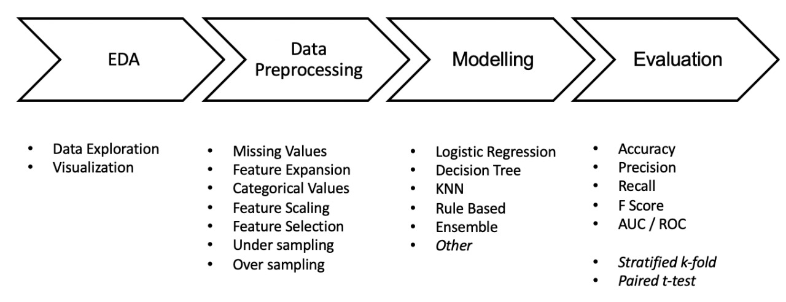

### Rainfall Prediction Using Machine Learning

## We have divided our project into mainly 7 parts. They are as follows:-
* **[Problem Statement](README.md/#Problem-Statement)**

* **[Objective](README.md/#Objective)**

* **[Dataset Used](README.md/#Dataset-Used)**

* **[Pipeline of the Project](README.md/#Pipeline-of-the-Project)**

* **[Architecture or Model](README.md/#Architecture-or-Model)**

* **[Predicted Output](README.md/#Prediction)**

* **[References](README.md/#References)**

# Problem Statement
Climate is a important aspect of human life. So, the Prediction should accurate as much as possible. In this paper we try to deal with the prediction of the rainfall which is also a major aspect of human life and which provide the major resource of human life which is Fresh Water. Fresh water is always a crucial resource of human survival – not only for the drinking purposes but also for farming, washing and many other purposes.
oobj
Making a good prediction of climate is always a major task now a day because of the climate change.

Now climate change is the biggest issue all over the world. Peoples are working on to detect the patterns in climate change as it affects the economy in production to infrastructure. So as in rainfall also making prediction of rainfall is a challenging task with a good accuracy rate. Making prediction on rainfall cannot be done by the traditional way, so scientist is using machine learning and deep learning to find out the pattern for rainfall prediction.

# 🎯Objective
Rainfall forecasting is very important because heavy and irregular rainfall can have many impacts like destruction of crops and farms, damage of property so a better forecasting model is essential for an early warning that can minimize risks to life and property and also managing the agricultural farms in better way. This prediction mainly helps farmers and also water resources can be utilized efficiently. Rainfall prediction is a challenging task and the results should be accurate.

# 📊Dataset Used
This dataset contains about 10 years of daily weather observations from many locations across Australia.
RainTomorrow is the target variable to predict. It means -- did it rain the next day, Yes or No? This column is Yes if the rain for that day was 1mm or more.

[Dataset link from Kaggle](https://www.kaggle.com/jsphyg/weather-dataset-rattle-package)

# Architecture or Model
The overall architecture include four major components: Data Ex-ploration and Analysis, Data Pre-processing, Model Implementation, and Model Evaluation.

# Prediction
We will be predicting the Rainfall based on the features suitable for rainfall. By considering the ConfusionMatrix, F1 Score. 

# References
* [Publication](https://www.researchgate.net/publication/336914968_Predicting_Rainfall_using_Machine_Learning_Techniques)

* [Visualization](https://github.com/mwaskom/seaborn)

* [Machine Learning](https://github.com/eriklindernoren/ML-From-Scratch)

## Source Code

